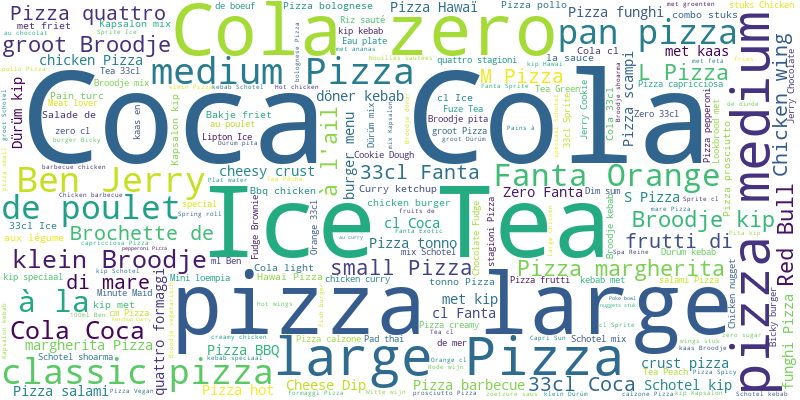
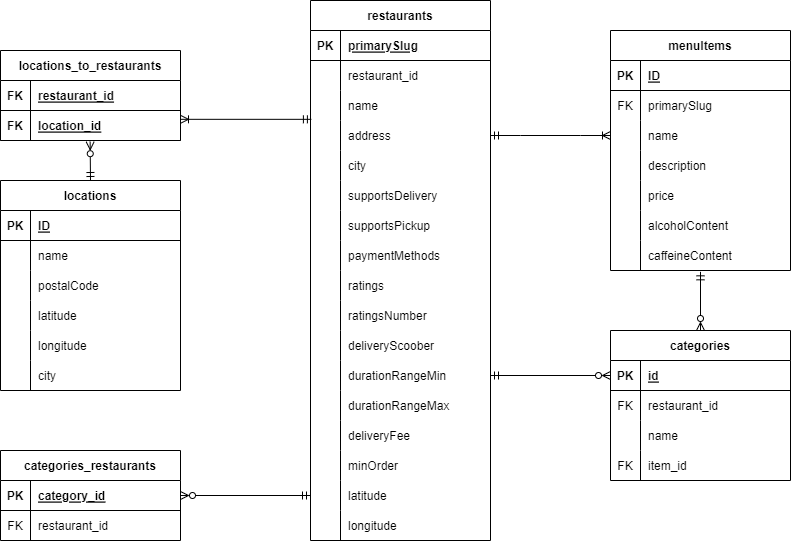

# Delivery Market Analysis

- Repository: `delivery-market-analysis`
- Type: `SQL + Visualization`
- Duration: `3 days`
- Deadline: `27/06/2025 15:00`
- Team: `Groups of 2`

## Mission Objectives

Enhance your data engineering and analytical skills by:
- Working with SQL operations like:
  - SELECT
  - JOIN
  - GROUP BY
  - Aggregations (e.g., average, sum)
- Exploring geospatial data analysis
- Extracting and visualizing insights from food delivery datasets
- Building data storytelling and presentation skills

## Learning Objectives

- Collaborate effectively. Maybe trying a ticketing systems like Trello for practice.
- Understand and query SQL database structures
- Optimize SQL queries for performance
- Visualize data insights using Python or Excel
- Deliver impactful presentations with data-driven narratives

## The Mission

> We are analyzing Delivery data from Flanders to uncover actionable insights for restaurant partners and consumers. The objective is to explore trends, customer preferences, and market dynamics in the food delivery space.

Conduct exploratory analysis, summarize findings, and present actionable insights.

## Data

The database provided is in SQLite:
- **Takeaway Database** (takeaway.db)

**Note:** The database file (79.83 MB) is not included in the repository due to GitHub's file size limits. 
Please ensure you have the database file (`takeaway.db`) in the `database/` folder to run the analysis.

### Database Diagram

What do these little arrows mean? Can you figure it out? If not [look it up](https://www.lucidchart.com/pages/ER-diagram-symbols-and-meaning) to better understand the diagram. Use SQL queries to explore relationships between tables.

---

## Must-have Features

Answer these key business questions:
1. What is the price distribution of menu items?
2. What is the distribution of restaurants per location?
3. Which are the top 10 pizza restaurants by rating?
4. Map locations offering kapsalons and their average price.

Also answer these more open ended questions:
1. Which restaurants have the best price-to-rating ratio?
2. Where are the delivery ‘dead zones’—areas with minimal restaurant coverage?
3. How does the availability of vegetarian and vegan dishes vary by area?
4. Identify the **World Hummus Order (WHO)**; top 3 hummus serving restaurants.

---

## Nice-to-have Features

- Optimize SQL queries for speed and readability
- Suggest database schema improvements
- Add custom exploratory insights: Come up with 2 original analyses!
- Visualize overlap of restaurant categories on different platforms

---

## Constraints

You split the work however you want, it could be splitting who does what question or splitting who does what part (query design vs visualizations and presentation design). Remember that the client wants to be able to see your queries. They can be given in a jupyter notebook for your presentation or they can be in query files in a directory.

---

## Deliverables

1. **GitHub Repository:** Clone the GitHub classroom assignment and document the code there.
3. **Presentation:** Summarize findings in an engaging format (PDF or jupyter notebook for example). On Friday afternoon, after 3PM. The presentation should be 5 minutes with the most striking insights, no more, no less, the client is very demanding on timing.

---

## Steps

1. Create the repository
2. Study the brief: Who? Why? What?
3. Identify technical challenges: How?
4. Explore and understand the dataset
5. Write and optimize SQL queries
6. Select proper visuals as needed
7. Finalize and present results

---

## Evaluation

| Criterion      | Indicator                                              | Yes/No |
| -------------- | ------------------------------------------------------ | ------ |
| **Completion** | Each must-have question is answered                    |        |
|                | Queries and visualizations are included                |        |
| **Excellence** | SQL queries are efficient and documented               |        |
|                | Code follows best practices                            |        |
|                | Presentation is clear and compelling                   |        |

---

Happy analyzing! Let the data drive your insights.
